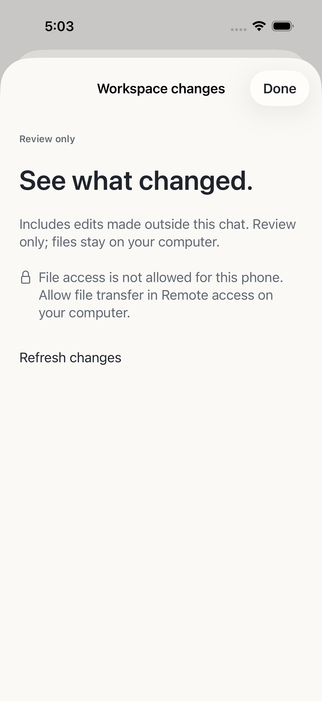

# Read-only workspace changes

The qualified adapter advertises optional `changes` independently of prompt
write availability. Older embeddings default to false. Compatible native health,
the default-off `remoteAccess` deployment policy and a computer-approved device
`fileTransfer` grant are all required. Removing access cancels pending reads.

The only new operations are:

- `GET /v1/workspaces/:wid/sessions/:sid/changes`
- `GET /v1/workspaces/:wid/sessions/:sid/changes/:id/diff?revision=…`

The pinned engine's scoped session-diff probe returned 404 on both measured
hosts. This implementation therefore reports **Workspace changes**, including
edits made outside the selected chat. It compares the verified execution root
to its current Git HEAD. A non-Git project, missing baseline or unsupported
repository gives a computer handoff rather than a misleading empty diff.

The native workspace registry and scoped session proxy establish ownership.
An external execution root must be a registered Git worktree with the same
canonical Git common directory. A nested project cannot expose its parent
repository. Opaque handles bind device, workspace, chat, baseline and file/root
revision; they expire after 15 minutes. Stale reads require a fresh list.

Fixed `/usr/bin/git` argument lists use no shell, external diff or textconv.
Optional index locks, replacements and filesystem monitors are disabled;
inherited Git configuration environment is removed. Owned regular single-link
files and their ancestor directories are checked before and after bounded
descriptor reads. Symlinks, traversal and unsafe path labels are rejected.
These checks do not promise an atomic snapshot against hostile same-user host
processes. There is no arbitrary file, shell or write endpoint.

Catalogs contain at most 100 files, with a 100 MiB measured-content budget and
20 MiB per file/baseline. Text diffs are at most 1 MiB and 10,000 lines. Omitted
content and unsupported submodules/paths explicitly continue on the computer.
Invalid UTF-8 or NUL content is binary and is not decoded as a text diff. Two
concurrent reads per device, eight globally and a 120-second scoped lease bound
resource use. All new responses retain no-store/nosniff behavior.

The native client renders passive, selectable text in 200-line pages, with
accessible Added/Removed labels and explicit shortened-line/content notices.
It offers no apply, revert, stage, commit or checkout action. Reads do not send
file contents to the configured model provider.

Qualification: 174 bridge tests, typechecking and bundle/declaration builds
passed on the Mac and actual Ubuntu x86_64 NUC, with 40 identical production
source hashes. Disposable native workspace/chat checks preserved file bytes,
Git index/status and comparable existing host state. Native Simulator flows
read the same changes through paired HTTPS on each host. Temporary pairing and
Serve mappings were removed afterwards. Physical iPhone/iPad, cellular recovery
and signed packaged host distribution remain separate acceptance gates.

