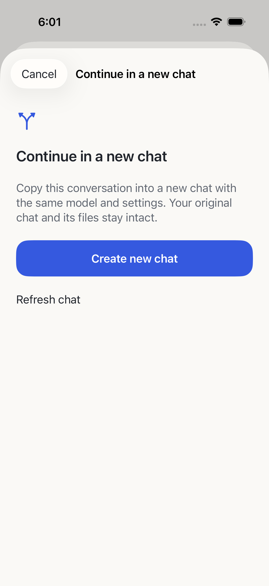
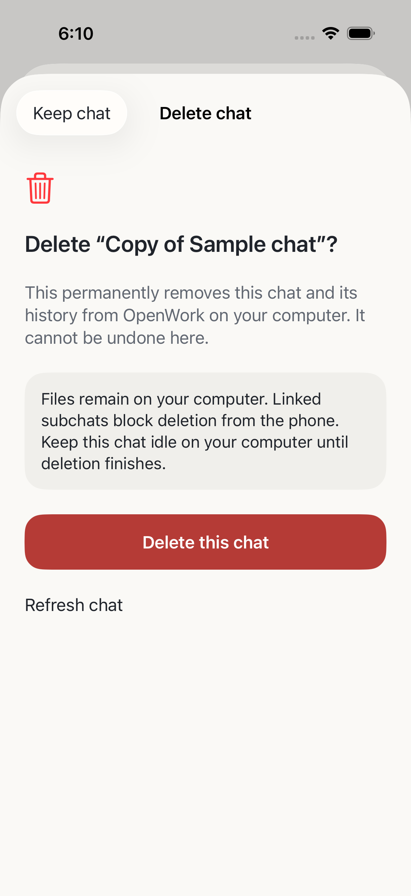

# Scoped chat copy and deletion

The existing default-off `remoteAccess` feature gates the package. Qualified
desktop integration advertises optional `forkSession`/`deleteSession`; old or
incompatible adapters keep both unavailable. Project access is checked again
after async work. No automatic approvals, arbitrary proxy or shell route exists.

- GET `/v1/workspaces/:wid/sessions/:sid/actions`: revision/idle/leaf preview.
- POST the same target's `/fork`: closed `{requestId,revision,beforeMessageId}`.
  Explicit null copies everything; a message ID excludes that message and later
  messages, validated against bounded native metadata paging.
- POST `/delete`: closed `{requestId,revision}`. Known linked subchats and running
  targets are refused. This is permanent deletion, with no qualified undo.

The native v2 fork body uses `boundary.type` through/before. Readback verifies
the new ID, exact `fork.sessionID`/boundary, absence of `parentID`, and inherited
model. `parentID` is the native subchat tree; native DELETE cascades that tree.
Preflight checks revision/status/known descendants but cannot atomically prevent
a subsequent desktop change. Clients must disclose that concurrency limitation.
Workspace files remain; the feature does not perform file cleanup.

Authorization precedes device/route/body-bound ledger replay. Replay precedes
target existence checks so a deleted target's receipt is still available. Only
the measured `session_unavailable` 404 plus a readable scoped session list can
confirm deletion. Authorization, workspace-home, generic 404 and transport
failures leave the outcome unverified. Mutations never retry automatically after
an uncertain dispatch. Fork metadata is capped at 1,000 rows; larger boundaries
require the computer. Feature-operation cancellation/revocation discards late
results under changed scope.

Mac and actual Ubuntu NUC passed 213 tests/typecheck/build, using 44 matching
production files. Paired HTTPS/native Simulator flows copied/deleted only owned
disposable copies and preserved existing host state, source content and pairing.
The live boundary flow verified replay and raw native model/file payloads; linked
subchat blocking is unit-qualified. Physical devices/full release remain open.

Synthetic iOS confirmations follow Penpot CA-01/CA-02 and DESIGN.md P3/P4/P9/P10/P11:
specific consequences, visible blocked states, explicit confirmation, screenshots
and retained context. No real transcript is present in the screenshots.

