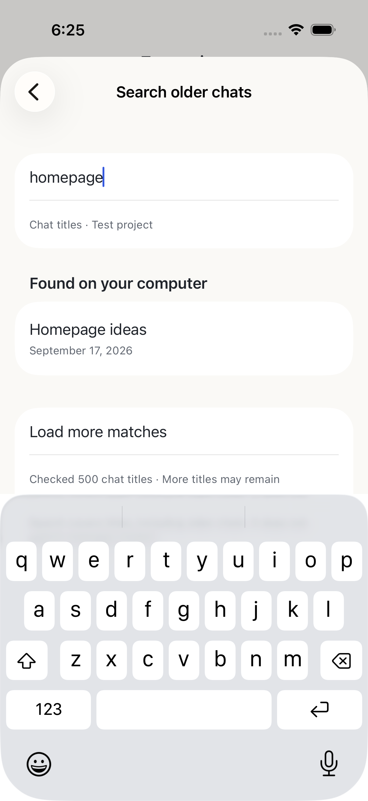

# Scoped older-title search

GET `/v1/workspaces/:wid/sessions/search?q=…&cursor=…` returns a closed
`{data,cursor,scanned,complete}` page. Only query and optional opaque cursor are
accepted. Device/project authorization and qualified `searchSessions` support
are required; authorization is rechecked before/after each native page and before
publishing results. The existing `remoteAccess` deployment feature stays default
off. This read operation does not need additional file/admin grants.

Matching uses NFKC and lowercase titles, 1–200 Unicode scalars, 500 rows/10 native
pages and 50 matches per request. Unconsumed native-page rows are retained for
continuation. The random cursor binds device/workspace/normalized query, expires
after 5 minutes and exposes no native cursor. Memory is bounded to four cursors
per device, 256 total and 1,024 native pages per scan. Expiry/limit asks clients to
restart/refine rather than falsely report completion. No persistent index,
transcript scanning, prompt or mutation exists. Bridge close clears the cache.

Search is eventually refreshed: native concurrent title/list changes may affect
later pages or fresh searches. Clients deduplicate IDs, protect generation/query
identity and show no-match only after `complete=true`; they keep partial results
and progress visible. Native cursor loops and foreign workspace rows fail closed.

Mac/actual Ubuntu NUC passed 227 tests/typecheck/build with 46 matching production
files. Real paired HTTPS/native Simulator flows searched older existing titles;
live lists had fewer than 50 chats, and unit/synthetic UI tests cover deeper
pagination. Temporary state/mappings were cleaned with existing state/pairing
preserved. Physical/public packaged release gates remain open.

Penpot SR-01 and DESIGN.md P3/P4/P10/P11 guide the secondary screen, visible
unsupported entry, screenshots and immediate navigation/context preservation.
The screenshot contains synthetic content only.

