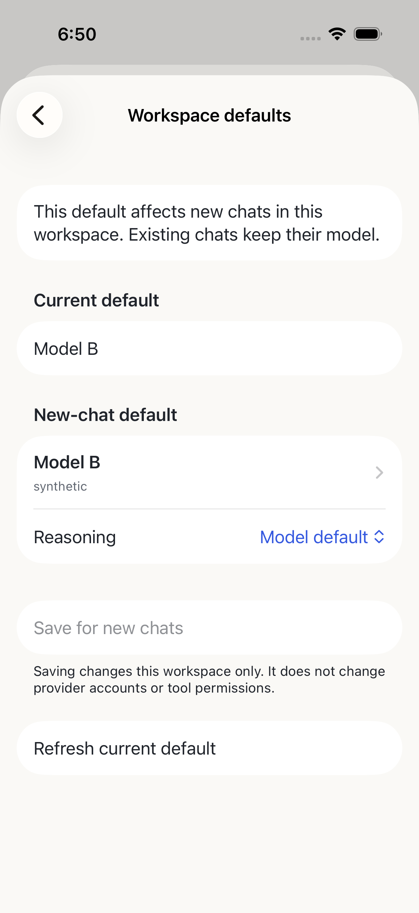

# Scoped workspace defaults

`GET /v1/workspaces/:wid/default-model` returns closed `{current,models,revision}`; `current` can explicitly be null. `POST` accepts only `{requestId,selection,revision}` and returns the existing mutation receipt. Both operations require current project scope, `workspaceAdministration`, qualified `workspaceDefaults` capability and the same-source native server. No current chat, global provider account or saved tool permission is changed.

The native workspace-default-model API adds an opaque revision and `conditionalWrite: true`, plus optional `revision` on its existing PUT. A single SQLite statement compares the exact old JSON and timestamp; absent-row insertion is conditional too. All native writers use a monotonically increasing timestamp, including legacy renderer writes, so same-millisecond value cycles do not restore an earlier revision. Legacy callers retain overwrite/null behavior. Only known zero-write CAS conflicts in that legacy path can reread and try again; phone conditional writes never retry.

The adapter reuses the native enabled-model catalog, checks the variant, forwards one fixed native PUT and compares authoritative readback to the successful native response. Only native coded `409 workspace_default_model_changed` is a known preflight rejection. A lost response, unrecognized rejection or intervening post-write change is uncertain. Missing native conditional support refuses editing rather than falling back to an unsafe PUT.

Current scope/grants are checked before every native default/catalog/write operation, before ledger replay and after awaited results. Device/UUID/route/body binding prevents a replay from forwarding twice or crossing targets. Phone intents remain protected and uncertain until explicit review. A successful save does not create a chat or execute a provider prompt; later chat creation inherits the scoped default through the existing path.

Qualification: Mac and actual Ubuntu x86_64 NUC each passed 245 bridge tests/45 files, typecheck/build, four native Node SQLite cases and a paired HTTPS native Simulator flow. The Mac also ran Bun SQLite stale/concurrent/independent-connection checks. Three synthetic native UI cases, 59 core/78 state tests and Release Simulator compilation passed. Two owned chats and one workspace per host were removed after restoring the original default; existing chats/settings/permissions/groups/pairings/ledger/Serve were preserved. Mac cleanup first revealed untitled native chats; the added delete regression fixed that refusal before guarded cleanup. This is source/native preview evidence, not physical acceptance, signing or a new TestFlight release.

The remoteAccess feature remains default-off. The matching desktop embedding explicitly enables its independently qualified defaults capability; standalone adapters keep it false by default. Repository protections and TLS validation are unchanged.

